**SENG 438- Software Testing, Reliability, and Quality**

**Lab. Report \#5 – Software Reliability Assessment**

| Group: 3                  |
|---------------------------|
| Student 1 Ahmed Abbas     |   
| Student 2 Rimal Rizvi     |   
| Student 3 Mariyah Malik   |   
| Student 4 Macayla Konig   |
|                        |

# Introduction

The primary objective of this lab assignment is to assess the reliability of a software system through the analysis of integration test data. To achieve this goal, two main techniques are employed: reliability growth testing and reliability demonstration chart.

### Reliability Growth Testing

Reliability growth testing involves the continuous monitoring and analysis of a software system's performance to identify and rectify defects, thereby improving its reliability over time. Through this technique, we aim to measure the failure rate, mean time to failure (MTTF), and overall reliability of the System Under Test (SUT). The analysis is facilitated by specialized tools such as SRTAT or C-SFRAT, which assist in importing failure data, selecting appropriate models, and generating relevant plots for analysis.

### Reliability Demonstration Chart

The reliability demonstration chart (RDC) serves as an efficient tool for assessing whether a software system meets predefined reliability targets. By collecting failure data at various time points, RDC helps in determining the trend of the system's reliability. This technique is particularly useful when the failure data is limited, and we need to evaluate if the target failure rate or MTTF is achieved. RDC analysis involves plotting failure points on a graph, identifying the target MTTF, and analyzing the trend to make informed decisions regarding the system's reliability.

In summary, this lab assignment provides hands-on experience in using these two techniques for software reliability assessment, aiming to enhance our understanding of software quality assurance practices and their application in real-world scenarios.

# Assessment Using Reliability Growth Testing 
In this part of the lab task, we had to pick out the top two models using the provided failure data. Using
the C-SFRAT had a great advantage because we could easily upload the CSV file into its user interface.
Then, we could utilize its functions to figure out which model suits our data best. This particular
feature:Model Results and Predictions, helped us narrow down the models that closely match our failure
data. To find the best two models, we assessed all possible comparisons with the factors involved. This
allowed us to examine all selected models and determine which one fits our failure data most accurately.

<!-- img1 -->
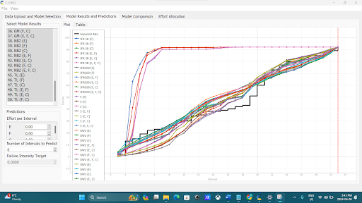

To compare these models, we accessed the Model Comparison tab, which provided us with a table showcasing all the models. From there, we could effortlessly pick out the top two models.
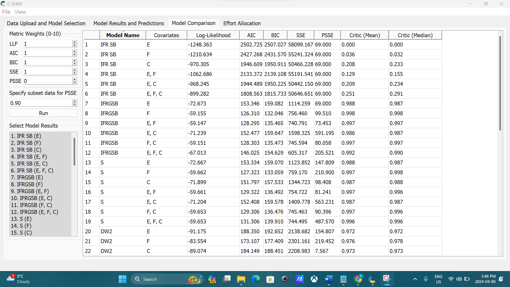
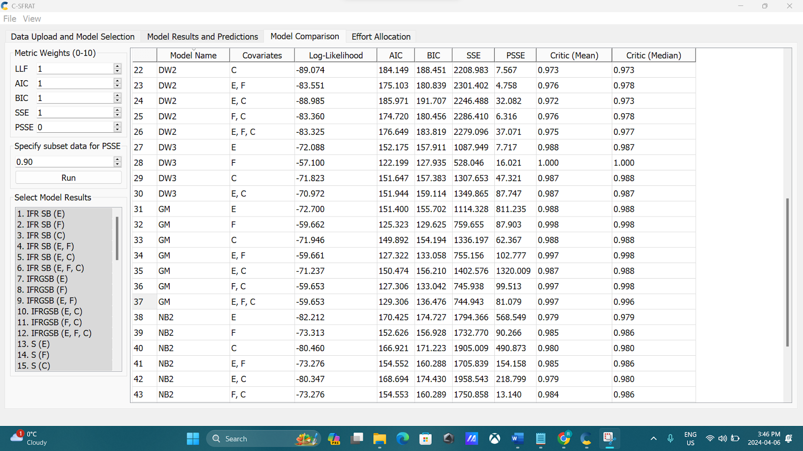
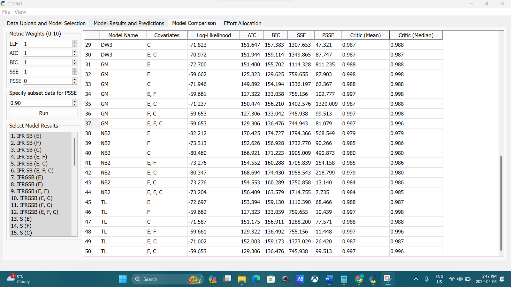

Using the table, we observed the log-likelihood values, which indicated how closely each model matched our failure data. From this, we identified that DW3 (F) and IFRGSB (E, F) were the closest models to our failure data. DW3 stands for Discrete Weibull (Type III), and IFRGSB refers to IFR generalized Salvia & Bollinger.

### Result of Range Analysis
For the range analysis, our approach involved identifying the data points that best aligned with the failure data graph. This strategy aimed to help us select the most suitable models from those provided by the C-SFRAT. Additionally, we paid close attention to the log-likelihood column, focusing on the two highest numbers (-57.100 and -59.147), which helped us pinpoint our top models as displayed below. The range was also crucially determined by the number of failures in the dataset. We divided it into 31 intervals to analyze the reliability of failures that occurred during those periods.

### Plots for failure rate and reliability of the SUT for the test data provided:

#### Model DW3 (F):
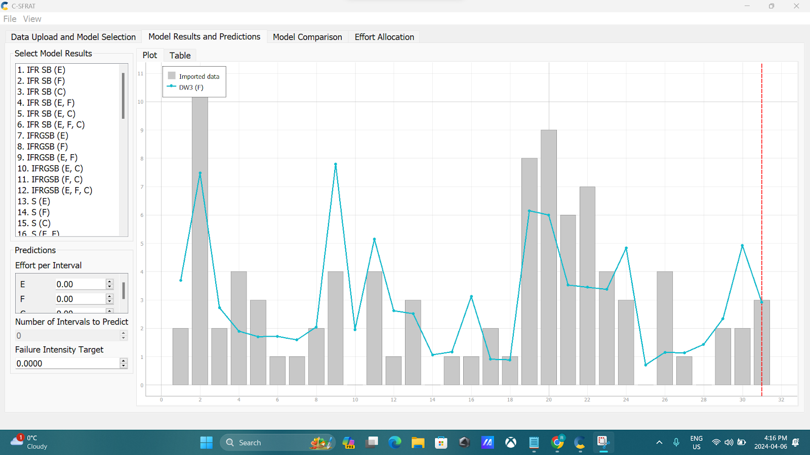
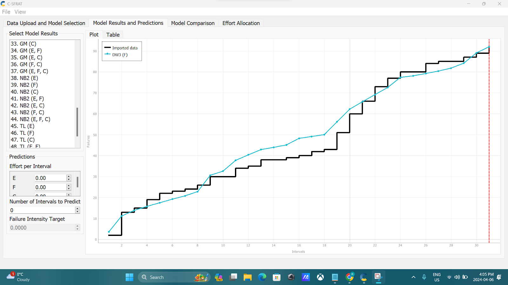

#### Model IFRGSB (E, F):
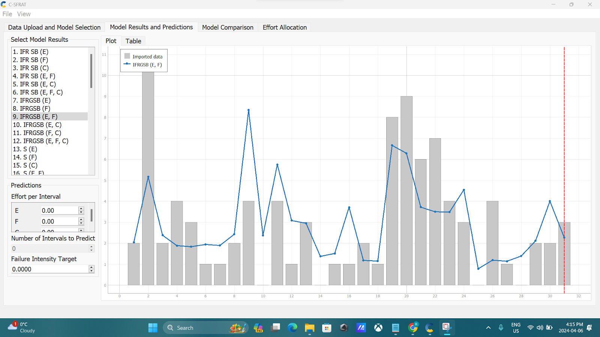
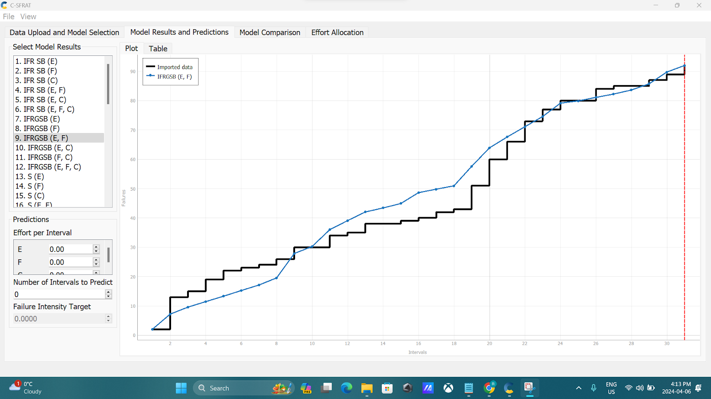

#### DW3 (F) && IFRGSB (E, F):
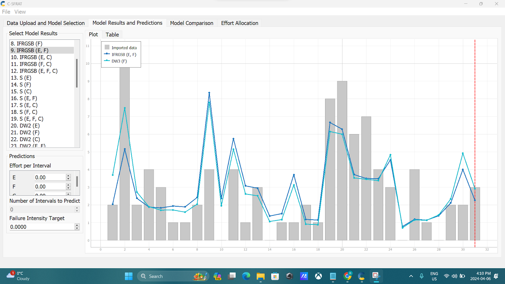

#### A discussion on decision making given a target failure rate:
To determine the failure rate target, we utilized the C-SFRAT tool once again, along with another tool called STRAT. These tools helped us predict the testing of new prediction intervals and estimate the failure rate based on the number of failures in the data. By combining insights from both tools, we calculated the failure rate by dividing the total number of failures by the hours the system operated. This failure rate is crucial for assessing the need for testing improvements to reduce the occurrence of failures when the system is released to end-users. Our goal was to achieve the lowest possible failure rate to ensure the reliability of the provided failure data and the safety of the application. After analyzing our predictions, we set a target failure rate of 0.4, as this was the lowest intensity observed for both models within the desired intervals displayed in the intensity graph. Achieving this target failure rate would enhance the reliability of the failure data and ensure the system's safety during testing.

# Assessment Using Reliability Demonstration Chart 
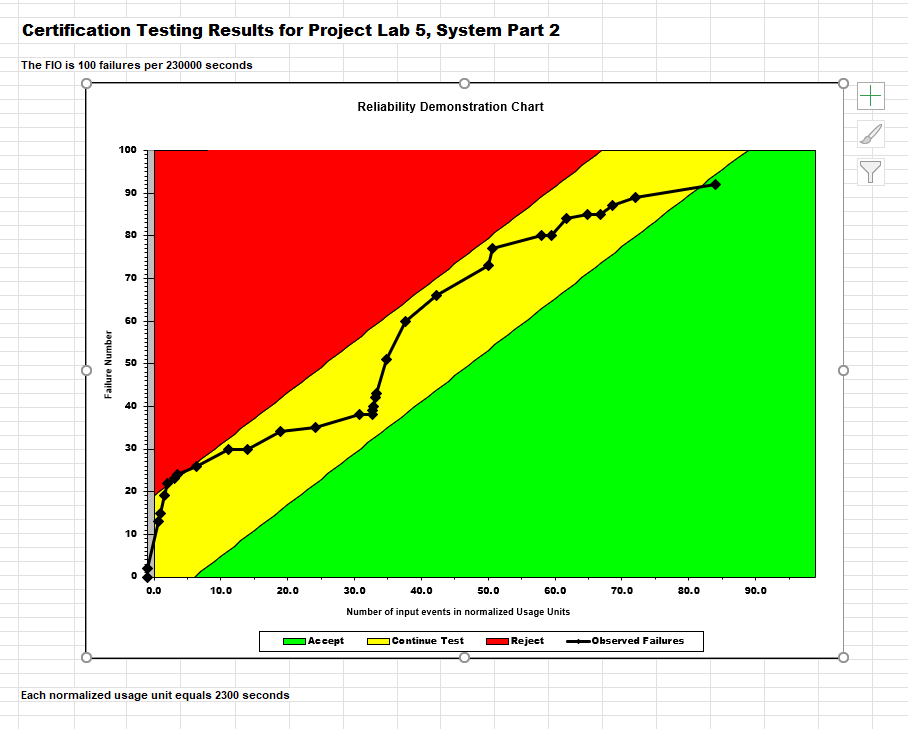
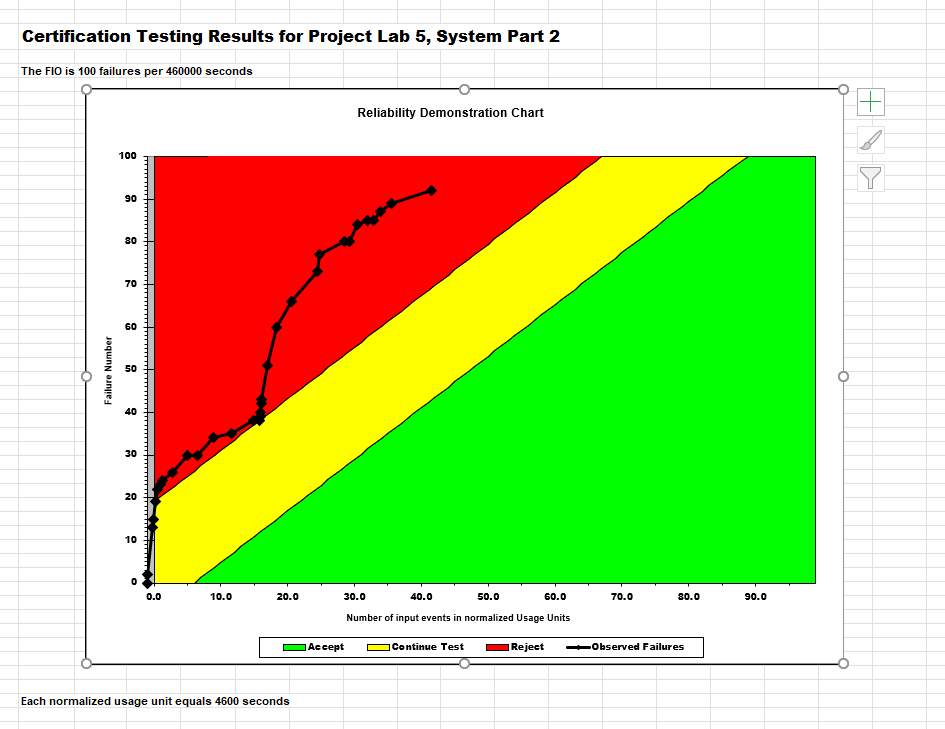
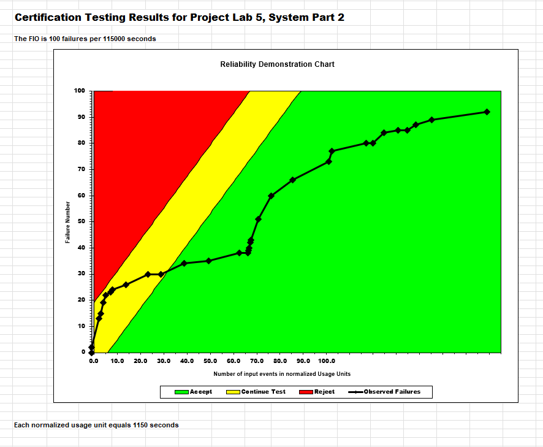
#### Explain your evaluation and justification of how you decide the MTTFmin:	
To determine the MTTFmin, we employed a trial-and-error approach with the RDC chart. Initially, we adjusted the data to ensure correct graph axes alignment, then proceeded to tweak the data for MTTF calculation until we found an optimal value. When selecting the MTTF value, we experimented with whole values divisible by 10, such as 200 failures, 500, 100, 50, and so forth, along with varying numbers of input events like 100,000, 200,000, 50,000, and so on. However, constant shifts in the graph regions necessitated significant time for adjustment during each trial. Instead of continuous testing with more specific values, we settled on one that reasonably aligned with the given data, resembling trends depicted in lecture slides. This value was identified as 230,000 input events (measured in seconds) per 100 acceptable failures, resulting in an MTTFmin of 2300 sec (0.64 hrs).  We specifically chose this MTTFmin value because it ensured that the majority of data points fell within the "continue testing" zone, ultimately leading to the System Under Test (SUT) becoming acceptable.

# Comparison of Results

When comparing Reliability Growth Testing and Reliability Demonstration Chart we can conclude that:
- Both assessments attempt to ensure the reliability and safety of the system under test but employ different methodologies
- Reliability growth testing focuses on selecting models that closely match failure data, while reliability demonstration chart focuses on determining MTTFmin through graph analysis
- Reliability growth testing involves analysis of failure data using tools like C-SFRAT, while reliability demonstration chart involves trial-and-error testing to find an optimal MTTFmin value
- Both assessments require careful analysis and decision making to achieve desired reliability targets, albeit through different approaches

## Model Selection vs. MTTFmin Determination:
#### Reliability Growth Testing
The primary outcome of reliability growth testing was the selection of two models, DW3 (F) and IFRGSB (E, F), based on their close alignment with the failure data. This selection was made using criteria such as log-likelihood values and range analysis, aiming to identify models that accurately represent the failure behavior of the system.

#### Reliability Demonstration Chart
The primary outcome of the reliability demonstration chart was determining the Minimum Time To Failure (MTTFmin). This was achieved through iterative adjustments of data until an optimal MTTFmin value was found. The chosen value, 2300 seconds (0.64 hours), was based on its alignment with the given data and ensuring the majority of data points fell within the appropriate range.

## Approach to Analysis:
#### Reliability Growth Testing
The analysis in reliability growth testing involved assessing various models against the failure data to identify the best-fitting ones. This involved utilizing tools like C-SFRAT, range analysis, and decision-making based on failure rate targets. The approach was more focused on statistical modeling and comparison.

#### Reliability Demonstration Chart 
The analysis in reliability demonstration chart involved graphical interpretation and trial-and-error testing to determine the MTTFmin. This approach relied on visually analyzing the graph and adjusting data until an acceptable MTTFmin value was achieved. It was more empirical and iterative.

## Outcome Interpretation:
#### Reliability Growth Testing
The outcome of reliability growth testing provided insight into the models that represent the failure behavior of the system. It helped in understanding the reliability growth process and selecting appropriate models for further analysis.

#### Reliability Demonstration Chart 
The outcome of the reliability demonstration chart provided a specific value (MTTFmin) that indicates the minimum time required between failures for the system to be considered acceptable. This value influences decisions regarding the continuation or conclusion of testing.

## Decision-Making Context:
#### Reliability Growth Testing
The decision-making context in reliability growth testing revolves around selecting models that optimize reliability and safety. This involves setting failure rate targets based on analysis and predictions to ensure the system meets reliability requirements.

#### Reliability Demonstration Chart
The decision-making context in reliability demonstration chart revolves around determining whether the observed failure rate meets acceptability criteria based on the calculated MTTFmin. This influences decisions on whether to continue testing or not.

# Discussion on Similarity and Differences of the Two Techniques

Reliability growth testing and reliability demonstration chart are two techniques used for software reliability assessment, but they differ in their approach and purpose.

### Similarities:

1. Both techniques aim to assess the reliability of a software system.
2. They involve the collection and analysis of failure data.
3. They help in making informed decisions regarding the system's reliability.

### Differences:

1. Approach:
    - Reliability growth testing focuses on continuous monitoring and analysis of the software system's performance to identify and rectify defects, improving its reliability over time.
    - Reliability demonstration chart assesses whether a software system meets predefined reliability targets by collecting failure data at various time points and analyzing the trend.

2. Purpose:
    - Reliability growth testing aims to measure the failure rate, mean time to failure (MTTF), and overall reliability of the System Under Test (SUT).
    - Reliability demonstration chart helps in determining if the target failure rate or MTTF is achieved when the failure data is limited.

### Advantages and Disadvantages:

Reliability Growth Testing:
- Advantages:
  - Allows for continuous improvement of the software system's reliability.
  - Provides insights into the system's failure rate and MTTF.
  - Facilitates the identification and rectification of defects.
- Disadvantages:
  - Requires continuous monitoring and analysis, which can be time-consuming.
  - Relies on the availability of failure data for analysis.

Reliability Demonstration Chart:
- Advantages:
  - Efficient tool for assessing if a software system meets predefined reliability targets.
  - Useful when failure data is limited.
  - Helps in making informed decisions regarding the system's reliability.
- Disadvantages:
  - Relies on the accuracy and representativeness of the collected failure data.
  - May not provide insights into the system's failure rate and MTTF.

### Appropriate Use:

Reliability growth testing is most appropriate when:
- The software system is still under development or in the early stages of deployment.
- Continuous improvement of the system's reliability is desired.
- Detailed analysis of failure rate and MTTF is required.

Reliability demonstration chart is most appropriate when:
- The software system is mature and nearing the end of its development cycle.
- Limited failure data is available.
- The focus is on determining if the target failure rate or MTTF is achieved.

# How the team work/effort was divided and managed
In managing the team work for this assignment, we held a team meeting to discuss the assignment's requirements and allocate responsibilities. As a team we researched and installed the reliability assessment tools. Rimal and Ahmed focused on data preparation and formatting. Mariyah and Macayla took the task of interpreting the results and documenting our findings. To ensure equitable distribution of workload, we periodically reviewed our progress and adjusted responsibilities as needed. Additionally, we communicated regularly to address any challenges or roadblocks encountered along the way. Overall, we effectively managed our team work and successfully completed the lab assignment.

# Difficulties encountered, challenges overcome, and lessons learned
Throughout this assignment, we encountered several difficulties, primarily from our unfamiliarity with the reliability assessment tools and concepts involved. One of the significant challenges we faced was the conversion of input data into a compatible format for the selected tools, particularly when using SRTAT and C-SFRAT. Understanding data formatting and ensuring its compatibility with the tools was a very time-consuming process. Additionally, interpreting the results and understanding the implications of various reliability metrics required was a challenge. However, through our team efforts, we managed to overcome these challenges. We used online resources, consulted documentation, and collaborated as a team to solve issues and navigate through the complexities of the lab assignment. Overall, these challenges provided valuable learning opportunities, taught us the importance of thorough preparation, effective communication, and perseverance when tackling unfamiliar tasks such as reliability assessment.

# Comments/feedback on the lab itself
We found this lab to be quite challenging due to the lack of clarity in the instructions provided. As a team using these tools for the first time, we encountered difficulties in navigating through the setup and execution processes. The absence of detailed guidance made it challenging to know where to begin with the lab. While the objectives were outlined, the step-by-step instructions for utilizing the reliability assessment tools were insufficient for beginners. Clearer explanations and more detailed directions would have been very helpful in helping us understand and progress throughout the lab. Additionally, including examples or walkthroughs similar to previous labs in this course would have been helpful. Moving forward, providing more detailed instructions or supplementary resources could really help with confusion and enhance the overall learning experience.
